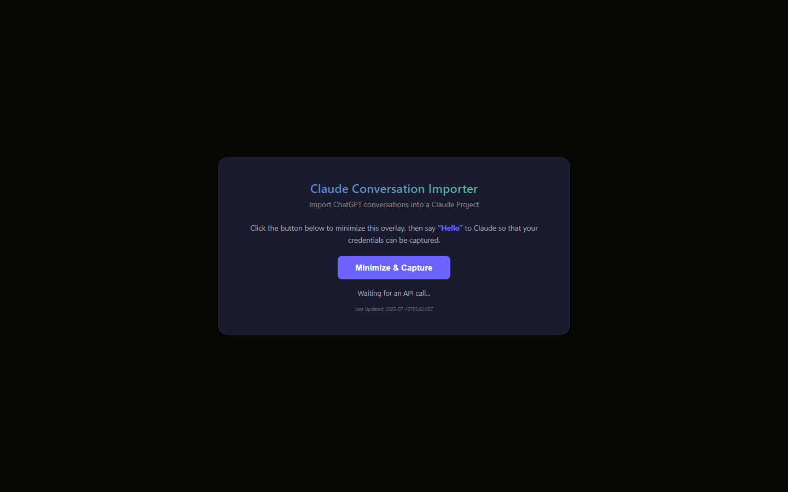
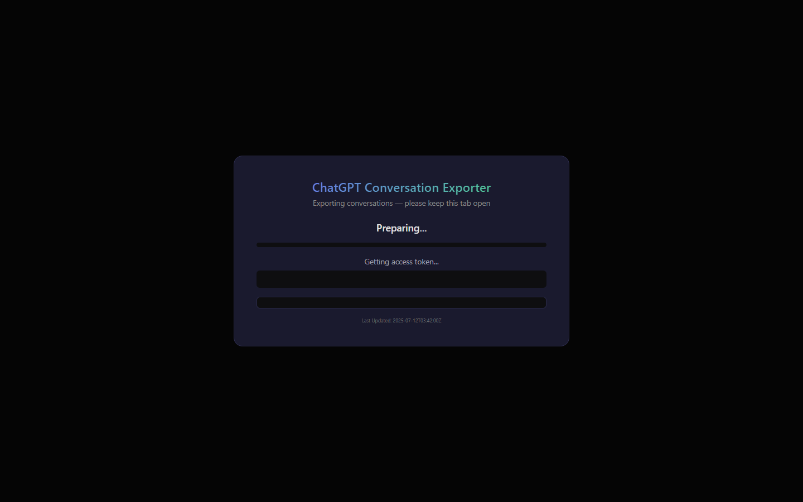

# Ciao-ChatGpt-Bonjour-Claude

Move every ChatGPT conversation into a Claude Project with two browser-console scripts: no API keys, no extensions, no installs, and nothing leaves your browser except the calls to the two services.

   



| Step | Script | Where to run | What it does |
|---|---|---|---|
| 1 | `ChatGPTConversationExporter.js` | chatgpt.com | Exports every conversation as a `.txt` inside a `.zip`. |
| 2 | `ClaudeConversationImporter.js` | claude.ai | Reads the `.zip`, lets you pick a Claude Project, and imports each conversation as a new Claude chat. |

Both scripts work the same way: open F12, then Console, paste the script, press Enter. They reuse the session the browser already holds for each site, so there is nothing to configure.

Conversations are exported as a flat zip of `.txt` files. ChatGPT project and folder structure is not preserved; the importer places every conversation into a single Claude Project of your choosing.

## Why

- Switch assistants without leaving years of conversations behind.
- Skip API keys, browser extensions and installers: two pasted scripts do the whole job.
- Keep your data in your own browser; neither script loads any third-party code.
- Pick up the conversations ChatGPT hides behind the sidebar's "Show more", because the exporter also walks every ChatGPT Project.
- Get readable plain-text transcripts as a bonus, labelled by speaker.

## Features

- **Full export** of the conversation list plus every ChatGPT Project's conversations, de-duplicated.
- **Plain-text transcripts** with a title banner, the date and one block per message, labelled You, ChatGPT, System or Tool.
- **Built-in zip writer and reader** in pure JavaScript, so no CDN script is needed (chatgpt.com's Content Security Policy blocks them).
- **Organization and project pickers** on claude.ai; each conversation becomes a new chat in the chosen project.
- **Progress overlays** with a counter, progress bar, current item, a log of warnings and errors, and a summary at the end.
- **Polite pacing** with a fixed delay between API calls.



## Quick start

Requirements:

- A modern browser (Chrome, Edge, Firefox and similar).
- An active, logged-in session on chatgpt.com (step 1) and claude.ai (step 2).
- No extensions, API keys or external tools.

Export from ChatGPT:

1. Go to [chatgpt.com](https://chatgpt.com) and make sure you are logged in.
2. Press F12 (or right-click, Inspect) to open Developer Tools, and click the Console tab.
3. Copy the entire contents of `ChatGPTConversationExporter.js`, paste it into the console and press Enter.
4. A full-screen progress overlay appears. Keep the tab open until the export finishes.
5. When it completes, a zip named like `chatgpt_export_2025-07-12-03-42-00.zip` (the current date and time) downloads automatically.

Import into Claude:

1. Go to [claude.ai](https://claude.ai) and make sure you are logged in. Create the Claude Project you want to import into if you have not already.
2. Open Developer Tools, Console, paste the entire contents of `ClaudeConversationImporter.js` and press Enter.
3. Click **Minimize & Capture**, then send any message in Claude's chat (the overlay suggests "Hello"). This lets the script capture your session's request headers.
4. The overlay comes back with a file picker. Select the zip from the export.
5. If you belong to more than one Claude organization (for example a personal plan and a Team workspace), choose one.
6. Choose the Claude Project to import into.
7. The script imports every conversation as a new chat in that project. A summary shows how many were imported and how many failed. Click **Close** to dismiss.

## How the exporter works

1. **URL check:** verifies the script is running on `chatgpt.com`; otherwise it shows an alert and exits.
2. **Authentication:** gets your session access token from `/api/auth/session` and sends it as a Bearer token on every later request.
3. **Discovery:** pages through `/backend-api/conversations` (100 per page, ordered by `updated`) to list every conversation.
4. **Project scan:** fetches all ChatGPT Projects from `/backend-api/projects` and pages through each project's conversations. Any not already seen are merged in.
5. **Fetch:** loads the full message tree for each conversation from `/backend-api/conversation/{id}`.
6. **Extract:** walks the message tree depth-first (iterative stack), joins each message's content parts into plain text and labels it by role.
7. **Package:** writes each conversation as a `.txt` file in a flat zip with the built-in writer (STORE method, no compression).
8. **Download:** builds the zip in the browser and triggers the download.

ChatGPT endpoints used:

| Endpoint | Method | Purpose |
|---|---|---|
| `/api/auth/session` | GET | Get the current session access token |
| `/backend-api/conversations?offset={n}&limit=100&order=updated` | GET | Page through the conversation list |
| `/backend-api/projects?offset={n}&limit=100&order=most_recent` | GET | Discover all ChatGPT Projects |
| `/backend-api/conversations?project_id={id}&offset={n}&limit=100&order=updated` | GET | Page through the conversations inside one project |
| `/backend-api/conversation/{id}` | GET | Fetch the full message tree of one conversation |

Exporter settings (constants at the top of the script):

| Variable | Default | Description |
|---|---|---|
| `DELAY_MS` | `250` | Milliseconds to wait between API calls |
| `BASE` | `/backend-api` | Base path for ChatGPT backend calls |

### Conversation format

Each `.txt` file looks like this:

```text
======================================================================
  Conversation Title
======================================================================
  Date: 1/15/2025, 3:42:00 PM

--- You ---
User message text

--- ChatGPT ---
Assistant response text

======================================================================
  End: Conversation Title
======================================================================
```

| API role | Label |
|---|---|
| `user` | You |
| `assistant` | ChatGPT |
| `system` | System |
| `tool` | Tool |
| anything else | the raw role string |

### File names

Titles are sanitized: the characters `< > : " / \ ? *` and the pipe character are replaced with an underscore, runs of whitespace collapse to one space, leading and trailing dots are stripped, and names are cut to 100 characters (an empty title becomes `Untitled`). If two conversations share a title, later files get a numeric suffix:

```text
Some Title.txt
Some Title (1).txt
Some Title (2).txt
```

### Built-in zip writer

1. Encodes each file as UTF-8 and computes its CRC-32.
2. Writes local file headers followed by the raw file data.
3. Writes a central directory with one entry per file.
4. Writes the end of central directory (EOCD) record.
5. Returns the result as a `Blob` for download.

No external libraries are loaded, which avoids chatgpt.com's Content Security Policy blocking third-party CDN scripts.

## How the importer works

1. **URL check:** verifies the script is running on `claude.ai`; otherwise it shows an alert and exits.
2. **Header capture:** the overlay minimizes and the script wraps `window.fetch` to capture the request headers, and the active model name, from the next Claude API call you trigger by sending a message. It then makes its own calls with an un-patched native `fetch` taken from a hidden iframe.
3. **File selection:** a styled file picker that accepts `.zip`.
4. **Parse:** reads the zip in the browser with the built-in reader and collects every `.txt` file into a flat list, whatever folders the zip has.
5. **Organization picker:** loads your organizations from `/api/organizations`. Single-organization accounts skip the picker.
6. **Project picker:** lists your existing Claude Projects; every conversation goes into the one you choose.
7. **Create conversations:** for each file, creates a chat with the conversation title and the project, then sends the transcript as the first message through the streaming completion endpoint and drains the response so the server commits the conversation.
8. **Summary:** shows how many conversations were imported and how many failed.

Why this works: Claude's web app wraps `window.fetch` and adds its session headers internally. The script captures those headers from one real call, then uses the browser's native `fetch` with the same credentials, which bypasses the wrapper while keeping your login.

Claude endpoints used:

| Endpoint | Method | Purpose |
|---|---|---|
| `/api/organizations` | GET | List your organizations |
| `/api/organizations/{orgId}/projects` | GET | List existing projects for the picker |
| `/api/organizations/{orgId}/chat_conversations` | POST | Create a chat (`uuid`, `name`, `project_uuid`) |
| `/api/organizations/{orgId}/chat_conversations/{convId}/completion` | POST | Send the transcript as the first message (streaming) |

Importer settings:

| Variable | Default | Description |
|---|---|---|
| `DELAY_MS` | `250` | Milliseconds to wait between API calls |

### Built-in zip reader

1. Scans backwards from the end of the `ArrayBuffer` for the EOCD signature (`0x06054b50`).
2. Reads the central directory entries for each file's name, compression method, compressed size and local header offset.
3. Parses each local file header to find where the data starts.
4. Decompresses: STORE (method 0) entries are used as-is; DEFLATE (method 8) entries go through the browser's built-in `DecompressionStream`.
5. Decodes the bytes as UTF-8 text.

The exporter writes STORE zips, but the importer also handles DEFLATE zips made by other tools. Directories and zero-length entries are skipped.

## Privacy and security

- **Your data stays in your browser.** Both scripts run inside your active session; conversations are read from one service and written to the other by the same browser that already has access to both.
- **No third-party servers.** Neither script loads external resources; both use only built-in browser APIs.
- **No API keys.** Both scripts use the session your browser already holds for chatgpt.com and claude.ai.
- **Credentials are never stored.** Tokens and headers live in memory for the length of the run and are gone when the page closes.

## Overlays

Both scripts draw a full-screen dark overlay to show progress.

Exporter overlay:

- Header "ChatGPT Conversation Exporter".
- A progress bar, a counter of conversations, a status line and the title currently being exported.
- A log panel for warnings (yellow) and errors (red).
- "Export Complete!" with the totals and a Close button at the end.

Importer overlay:

- Header "Claude Conversation Importer".
- The Minimize & Capture step, then the zip file picker.
- Organization and project pickers.
- The same progress layout as the exporter.
- "Import Complete!" with a summary and a Close button.

## Limitations

| Area | Detail |
|---|---|
| Rate limiting | Both scripts wait a fixed `DELAY_MS` between calls. If you hit rate limits, raise it. |
| Project structure | ChatGPT projects and folders are not preserved; everything goes into one Claude Project. |
| Conversation size | Very large conversations may run into Claude's message size limits. |
| Zip compression | The importer supports STORE and DEFLATE only. |
| Browser tab | The tab must stay open, and in the foreground, for the whole run. |
| Session expiry | Very long exports (thousands of conversations) can outlive the session token. Re-run the script if that happens. |
| Message types | Only text is exported. Images, file attachments and DALL-E generations are not included. |
| Private APIs | Both scripts use the sites' own web endpoints, which can change without notice. |

## Troubleshooting

| Problem | Solution |
|---|---|
| "must be run on chatgpt.com" or "claude.ai" | You pasted the script on the wrong site. The exporter only runs on chatgpt.com; the importer only runs on claude.ai. |
| "No accessToken in session response" | Your ChatGPT session has probably expired. Refresh the page, make sure you are logged in, and try again. |
| "Not a valid zip file (no EOCD found)" | The selected file is not a zip. Select the zip from step 1. |
| "Failed to fetch orgs" | Your Claude session has probably expired. Refresh claude.ai, log in, and re-run the importer. |
| HTTP 429 errors | You are being rate-limited. Raise `DELAY_MS` (for example to `2000`) and try again. |
| The script does nothing | Check the console for errors. Some browsers make you type `allow pasting` before they accept a pasted script. |
| Missing conversations | The exporter skips conversations with no extractable text. Look for "No messages" warnings in the log panel. |

## Documentation

- [Copilot instructions](.github/copilot-instructions.md): notes for AI coding agents working in this repo.
- `README.htm` is an older generated copy of this page and is not kept in sync; this README is the current one.

## License

This repository has no LICENSE file; all rights are reserved. The scripts are provided as-is for personal use; use them at your own risk.

Part of [MindAttic](https://mindattic.com) — see more projects at [github.com/mindattic](https://github.com/mindattic). Related: [Audible-To-GoodReads](https://github.com/mindattic/Audible-To-GoodReads), another tool for moving your data between services.
